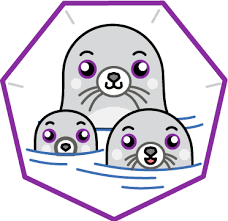

<h1 align="center">
 Containerization 
  
  

</h1>

The project contains the Dockerfiles required for the Predictor project. 

**Note**: _Podman and Docker can be used interchangeably throughout this document, unless specified otherwise_.

# Images

- [Clusters](https://github.com/barbacbd/predictor-pods/blob/main/clusters/README.md)
- [Criteria](https://github.com/barbacbd/predictor-pods/blob/main/criteria/README.md)
